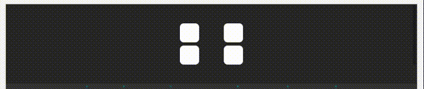
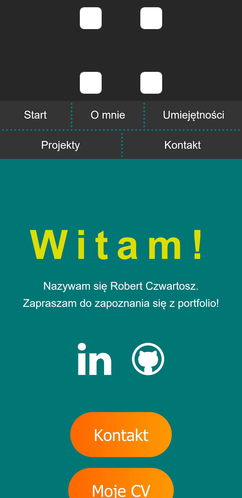
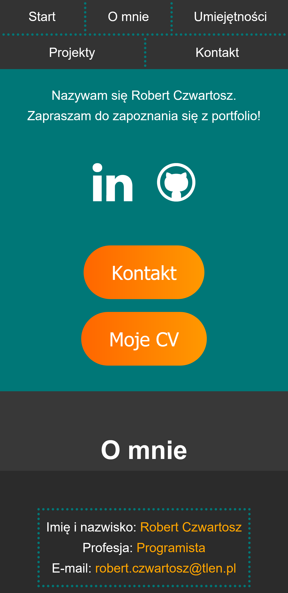
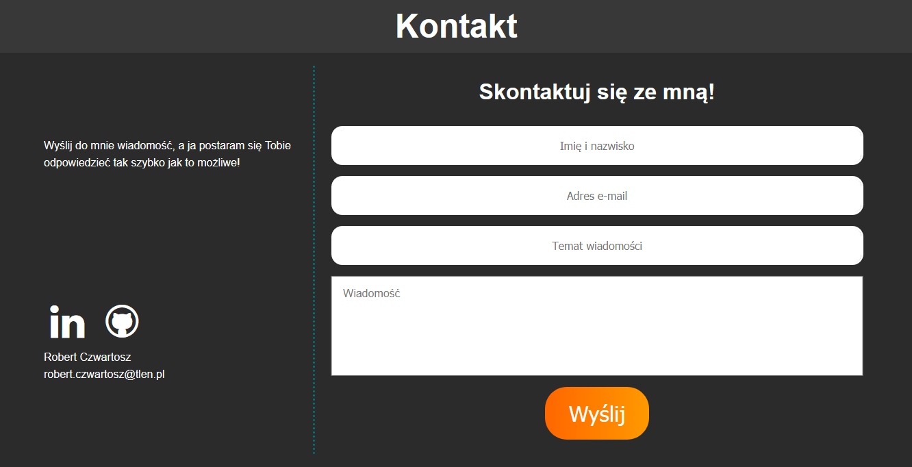
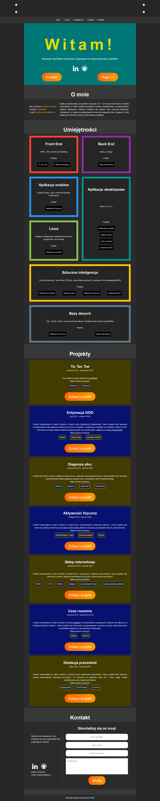
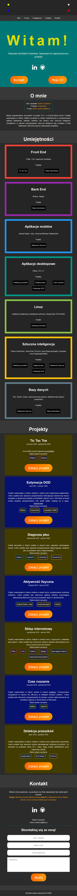
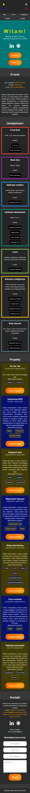

# Strona - Wizytówka
Projekt został stworzony w trakcie kursu programowania webowego CodersCamp. Celem projektu było stworzenie strony - wizytówki z zastosowaniem HTML i CSS. Strona stanowi portfolio opisujące moje umiejętności i projekty związane z programowaniem. Stronę można zobaczyć pod linkiem [https://robert-czwartosz.github.io/CodersCamp2020.Project.HTML-CSS.BusinessCard/](https://robert-czwartosz.github.io/CodersCamp2020.Project.HTML-CSS.BusinessCard/).

## Spis treści
1. [Zawartość repozytorium](#zawartosc-repozytorium)
2. [Zastosowane technologie](#zastosowane-technologie)
3. [Funkcjonalności](#funkcjonalnosci)
	1. [Animacja keyframes](#Animacja-keyframes)
	1. [Sticky navbar](#Sticky-navbar)
	1. [Możliwość pobrania mojego CV](#Mozliwosc-pobrania-mojego-CV)
	1. [Lista umiejętności podzielona na kategorie](#Lista-umiejetnosci-podzielona-na-kategorie)
	1. [Lista projektów udostępnionych na GitHubie](#Lista-projektow-udostepnionych-na-GitHubie)
	1. [Formularz](#Formularz)
	1. [Responsive Web Design](#Responsive-Web-Design)

## Zawartość repozytorium
* [index.html](index.html) - treść strony w HTML
* [style.css](style.css) - arkusz styli opisujący wygląd poszczególnych elementów strony
* [katalog fontello](fontello) - zawiera pliki umożliwiające dodanie ikonek
* [CV_Robert_Czwartosz.pdf](CV_Robert_Czwartosz.pdf) - moje CV w formacie .pdf

## Zastosowane technologie
* HTML
* CSS
* Fontello
* Responsive Web Design
* GitHub Pages

## Funkcjonalności
### Animacja keyframes

### Sticky navbar

### Możliwość pobrania mojego CV

### Lista umiejętności podzielona na kategorie

Każda kategoria zawiera obramowanie o unikalnym kolorze, listę umiejętności oraz listę projektów z nią powiązanych. Po kliknięciu w projekt następuje przeniesienie do danego projektu w sekcji Projekty.

### Lista projektów udostępnionych na GitHubie

Każdy projekt zawiera czas wykonywania, opis, listę zastosowanych umiejętności/narzędzi (kolor obramowania wskazuje na kategorię do której dana umiejętność/narzędzie należy) oraz przycisk odsyłający do odpowiedniego repozytorium na GitHubie. Po kliknięciu w umiejętność/narzędzie następuje przeniesienie do kategorii do której należy dana umiejętność/narzędzie. Po kliknięciu w przycisk "Zobacz projekt" zostaje otwarte repozytorium danego projektu w nowej karcie w przeglądarki.

### Formularz

Wysłanie formularza powoduje **jedynie** przeładowanie strony, dlatego nie jest możliwy kontakt poprzez formularz. W pobliżu formularza znajdują się ikonki po kliknięciu których w nowej karcie otwarty zostaje mój profil na LinkedIn lub GitHubie.

### Responsive Web Design
Zastosowanie Responsive Web Designu sprawia, że strona poprawnie się wyświetla na dowolnym ekranie oraz nie pojawia się poziomy pasek przewijania.
#### Wygląd strony na laptopie

#### Wygląd strony na tablecie

#### Wygląd strony na telefonie

