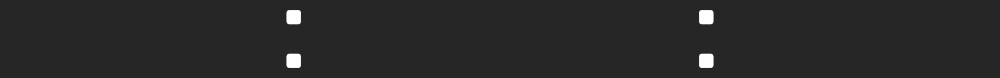

# Strona - Wizytówka
Projekt został stworzony w trakcie kursu programowania webowego CodersCamp. Celem projektu było stworzenie strony - wizytówki z zastosowaniem HTML i CSS. Strona stanowi portfolio opisujące moje umiejętności i projekty związane z programowaniem. Stronę można zobaczyć pod linkiem ......
## Zawartość repozytorium
* index.html - treść strony w HTML
* style.css - arkusz styli opisujący wygląd poszczególnych elementów strony
* katalog fontello - zawiera pliki umożliwiające dodanie ikonek
* CV_Robert_Czwartosz.pdf - moje CV w formacie .pdf

## Zastosowane technologie
* HTML
* CSS
* Fontello
* Responsive Web Design

## Funkcjonalności
### Animacja keyframes

### Sticky navbar
Screen navbar
Screen inny navbar
### Możliwość pobrania mojego CV
Screen moja strona
Screen moje CV
### Lista umiejętności podzielona na kategorie
Screeny skills
każda kategoria zawiera listę umiejętności oraz projektów z nią powiązanych
### Lista projektów udostępnionych na GitHubie
Screeny projects
każdy projekt zawiera czas wykonywania, opis, listę zastosowanych umiejętności/narzędzi (kolor obramowania wskazuje na kategorię do której dana umiejętność/narzędzie należy), przycisk odsyłający do odpowiedniego repozytorium na GitHubie
### Formularz
Screen formularz
wysłanie formularza powoduje **jedynie** przeładowanie strony)
### Responsive Web Design
Screen notebook
Screen tablet
Screen telefon
