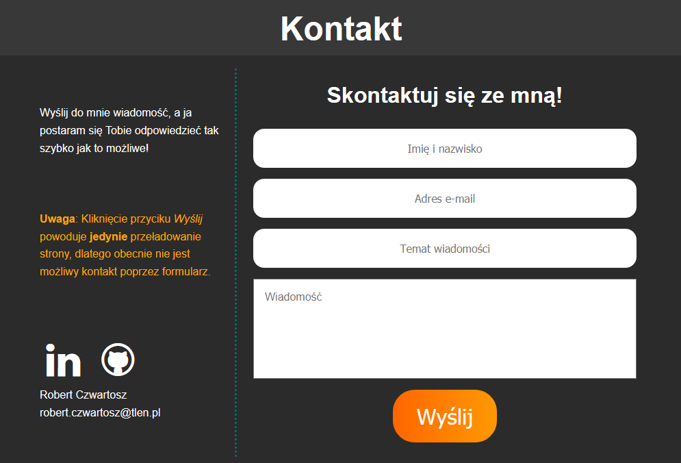

# Strona - Wizytówka
Projekt został stworzony w trakcie kursu programowania webowego CodersCamp. Celem projektu było stworzenie strony - wizytówki z zastosowaniem HTML i CSS. Strona stanowi portfolio opisujące moje umiejętności i projekty związane z programowaniem. Stronę można zobaczyć pod linkiem ......
## Zawartość repozytorium
* index.html - treść strony w HTML
* style.css - arkusz styli opisujący wygląd poszczególnych elementów strony
* katalog fontello - zawiera pliki umożliwiające dodanie ikonek
* CV_Robert_Czwartosz.pdf - moje CV w formacie .pdf

## Zastosowane technologie
* HTML
* CSS
* Fontello
* Responsive Web Design
* GitHub Pages

## Funkcjonalności
### Animacja keyframes

### Sticky navbar

### Możliwość pobrania mojego CV

### Lista umiejętności podzielona na kategorie

Każda kategoria zawiera obramowanie o unikalnym kolorze, listę umiejętności oraz projektów z nią powiązanych. Po kliknięciu w projekt następuje przeniesienie do danego projektu w sekcji Projekty.

### Lista projektów udostępnionych na GitHubie

Każdy projekt zawiera czas wykonywania, opis, listę zastosowanych umiejętności/narzędzi (kolor obramowania wskazuje na kategorię do której dana umiejętność/narzędzie należy) oraz przycisk odsyłający do odpowiedniego repozytorium na GitHubie. Po kliknięciu w umiejętność/narzędzie następuje przeniesienie do kategorii do której należy dana umiejętność/narzędzie. Po kliknięciu w przycisk "Zobacz projekt" zostaje otwarte repozytorium danego projektu w nowej karcie w przeglądarki.

### Formularz

Wysłanie formularza powoduje **jedynie** przeładowanie strony, dlatego nie jest możliwy kontakt poprzez formularz. W pobliżu formularza znajdują się ikonki po kliknięciu których w nowej karcie otwarty zostaje mój profil na LinkedIn lub GitHubie. Poniżej ikonek znajduje się moje imię i nazwisko oraz adres e-mail.

### Responsive Web Design

#### Wygląd strony na laptopie

#### Wygląd strony na tablecie

#### Wygląd strony na telefonie

